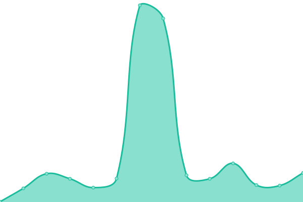
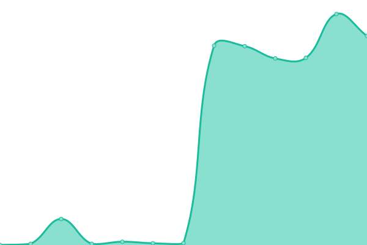
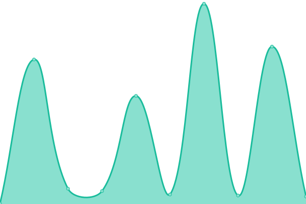
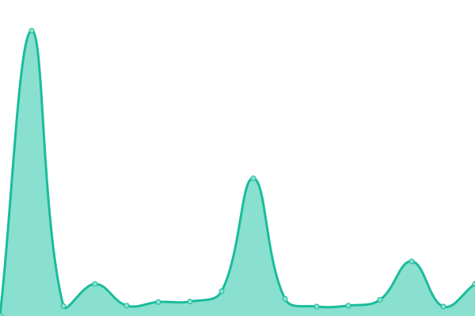
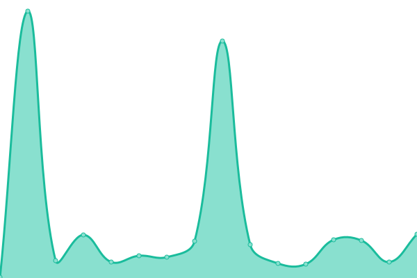

# [📈 Live Status](https://status.uem.edu.in): <!--live status--> **🟩 All systems operational**

This repository contains the open-source uptime monitor and status page for [UEM Group Websites](https://uem.edu.in), powered by [Upptime](https://github.com/upptime/upptime).

With [Upptime](https://upptime.js.org), you can get your own unlimited and free uptime monitor and status page, powered entirely by a GitHub repository. We use [Issues](https://github.com/UEM-Group-Websites/uptime-checker/issues) as incident reports, [Actions](https://github.com/UEM-Group-Websites/uptime-checker/actions) as uptime monitors, and [Pages](https://status.uem.edu.in) for the status page.

<!--start: status pages-->
<!-- This summary is generated by Upptime (https://github.com/upptime/upptime) -->
<!-- Do not edit this manually, your changes will be overwritten -->
<!-- prettier-ignore -->
| URL | Status | History | Response Time | Uptime |
| --- | ------ | ------- | ------------- | ------ |
|  [UEM Main Website](https://uem.edu.in/site-health-page/) | 🟩 Up | [uem-main-website.yml](https://github.com/UEM-Group-Websites/uptime-checker/commits/HEAD/history/uem-main-website.yml) | 

 3840ms
     
 | 

<a href="https://status.uem.edu.in/history/uem-main-website">99.46%</a>
    

|  [IEM Main Website](https://iem.edu.in/site-health-page/) | 🟩 Up | [iem-main-website.yml](https://github.com/UEM-Group-Websites/uptime-checker/commits/HEAD/history/iem-main-website.yml) | 

 299ms
     
 | 

<a href="https://status.uem.edu.in/history/iem-main-website">43.29%</a>
    

|  [UEM Jaipur Website](https://uem.edu.in/uem-jaipur/site-health-page/) | 🟩 Up | [uem-jaipur-website.yml](https://github.com/UEM-Group-Websites/uptime-checker/commits/HEAD/history/uem-jaipur-website.yml) | 

 3054ms
     
 | 

<a href="https://status.uem.edu.in/history/uem-jaipur-website">99.48%</a>
    

|  [UEM Kolkata Website](https://uem.edu.in/uem-kolkata/site-health-page/) | 🟩 Up | [uem-kolkata-website.yml](https://github.com/UEM-Group-Websites/uptime-checker/commits/HEAD/history/uem-kolkata-website.yml) | 

 3381ms
     
 | 

<a href="https://status.uem.edu.in/history/uem-kolkata-website">99.49%</a>
    

|  [UEM Staging Main Website](https://staging.uem.edu.in/site-health-page/) | 🟩 Up | [uem-staging-main-website.yml](https://github.com/UEM-Group-Websites/uptime-checker/commits/HEAD/history/uem-staging-main-website.yml) | 

 3807ms
     
 | 

<a href="https://status.uem.edu.in/history/uem-staging-main-website">100.00%</a>
    

|  [UEM Staging Jaipur Website](https://staging.uem.edu.in/uem-jaipur/site-health-page/) | 🟩 Up | [uem-staging-jaipur-website.yml](https://github.com/UEM-Group-Websites/uptime-checker/commits/HEAD/history/uem-staging-jaipur-website.yml) | 

 309ms
     
 | 

<a href="https://status.uem.edu.in/history/uem-staging-jaipur-website">100.00%</a>
    

|  [UEM Staging Kolkata Website](https://staging.uem.edu.in/uem-kolkata/site-health-page/) | 🟩 Up | [uem-staging-kolkata-website.yml](https://github.com/UEM-Group-Websites/uptime-checker/commits/HEAD/history/uem-staging-kolkata-website.yml) | 

 318ms
     
 | 

<a href="https://status.uem.edu.in/history/uem-staging-kolkata-website">100.00%</a>
    

<!--end: status pages-->

[**Visit our status website →**](https://status.uem.edu.in)

## 📄 License

- Powered by: [Upptime](https://github.com/upptime/upptime)
- Code: [MIT](./LICENSE) © [Anand Chowdhary](https://anandchowdhary.com), supported by [Pabio](https://pabio.com)
- Data in the `./history` directory: [Open Database License](https://opendatacommons.org/licenses/odbl/1-0/)
